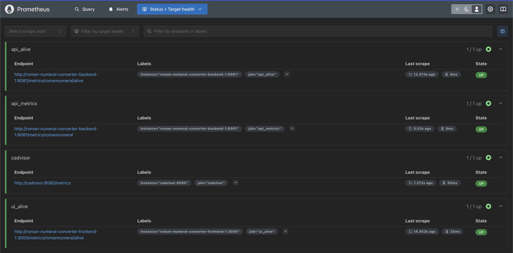
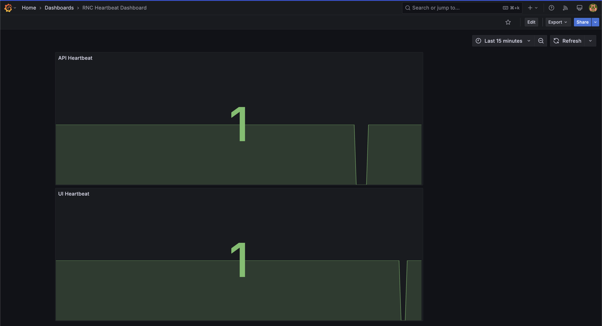
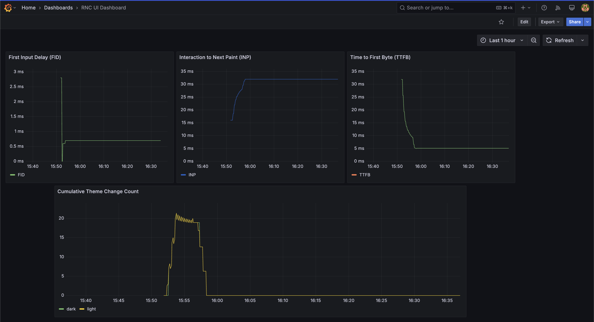
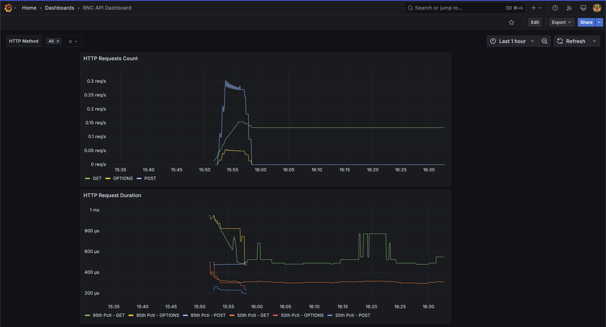
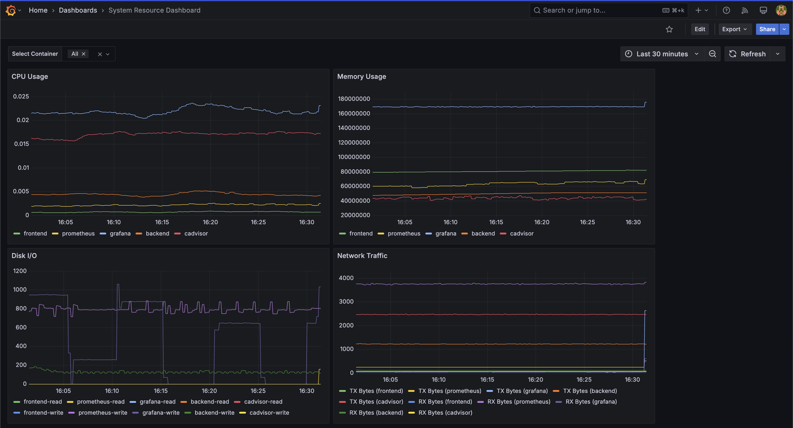

# roman-numeral-converter

This project is to develop a web application to convert a number into its roman numeral representation.

## Overview

This project adopts a microservices-style architecture with a fully containerized deployment, ensuring scalability, maintainability, and operational efficiency. The system is structured to allow independent development, testing, and deployment of components while maintaining a modular and adaptable architecture.

The React-based frontend interacts with the Node.js backend via REST APIs, ensuring a clean separation of concerns. The backend handles numeral conversions and exposes a Metrics API for performance monitoring. The Roman Numeral Logic is modularized, enabling seamless expansion to support additional numeral systems without requiring changes to the frontend.

For observability and monitoring, Prometheus collects real-time metrics from both the backend and infrastructure components. cAdvisor is integrated to gather container-level metrics such as CPU, memory, and network usage, which are then sent to Prometheus for analysis. These metrics are visualized using Grafana, providing insights into the application and container performance.

The entire system is containerized using Docker, ensuring consistency across environments and enabling efficient resource management.

Below is a high-level architectural diagram that illustrates how the different components interact:

```
+--------------------------+                        +---------------------------+
|   Frontend UI (React)    | <----REST API Call---> |   Backend API (Node.js)   |
|   - User Input           |                        |   - Convert Number        |
|   - Display Result       |                        |   - Collect Logs/Metrics  |
|   - Dark/Light Theme     |                        |                           |
+--------------------------+                        +---------------------------+
                                                                  |
                                                                  |
                                                    -----------------------------
                                                    |                           |
                                                    |                           |
    +------------------+                +----------------------+       +----------------------+
    | Container Metrics| -------------> | Metrics (Prometheus) |       | Roman Numeral Logic  |
    |  (cAdvisor)      |                +----------------------+       +----------------------+
    +------------------+                            |
                                                    |
                                                    v
                                        +----------------------+
                                        | Monitoring (Grafana) |
                                        +----------------------+
```

This project consists of two separate applications:

1. **Backend API (`roman-numeral-converter-api`)** - A Node.js-based REST API that converts numbers to Roman numerals.
2. **Frontend Application (`roman-numeral-converter-ui`)** - A Next.js-based React UI that interacts with the backend API.

Both applications work together to provide a user-friendly interface for Roman numeral conversion.

**PS**: For ease of readability, steps to execute both the applications are captured in this single readme document.

## Table of Contents
- Prerequisites
- Setup
  - Backend Setup
    - Environment Variables
  - Frontend Setup
    - Environment Variables
- Running the Application
- Option 1: Running With Docker
    - Running Application Without Tests
    - Running Application With Tests
- Option 2: Running Without Docker
    - Start the Backend Application
    - Start the Frontend Application
    - Testing
- Integration Testing
- Monitoring Dashboard
- API Documentation
- Engineering and Testing Methodology
- Dependency Attribution
- Project Structure
- Troubleshooting & Common Issues
- References

## Prerequisites

Before running the applications, install the following on your system:

- **[Node.js](https://nodejs.org/)** (version 22+ recommended)
- **[Docker](https://docs.docker.com/get-started/get-docker/)** (Docker version 27.5.1 recommended)
- **[Docker Compose](https://docs.docker.com/compose/install/)** (Docker Desktop already comes with Docker Compose. Otherwise, install Docker Compose separately)

## Setup

Clone the repository and navigate to the directory:
```sh
git clone https://github.com/monishongit/roman-numeral-converter.git
cd roman-numeral-converter
```

### Backend Setup (`roman-numeral-converter-api`)

Navigate to the backend directory:
```sh
cd <base-dir>/roman-numeral-converter/roman-numeral-converter-api
```

#### Environment Variables
Create a `.env` file in under `roman-numeral-converter-api/`:
```sh
touch .env
```
and copy/paste the follow content into the .env file:
```ini
RNC_API_BASE_URL=localhost
RNC_API_PORT=8081
RNC_UI_BASE_URL=localhost
RNC_UI_PORT=3000
LOG_LEVEL=info
```
- RNC_API_* indicates the config for the backend API
- RNC_UI_* indicates the config for the frontend, used for CORS setup

### Frontend Setup (`roman-numeral-converter-ui`)

Navigate to the ui directory:
```sh
cd <base-dir>/roman-numeral-converter/roman-numeral-converter-ui
```

#### Environment Variables
Create a `.env` file in under `roman-numeral-converter-ui/`:
```sh
touch .env
```
and copy/paste the follow content into the .env file:
```ini
NEXT_PUBLIC_RNC_API_BASE_URL=http://localhost:8081
```
This config indicates where the backend is running.

## Running the Application

### Option 1: Running With Docker

Running the application with docker comes with prometheus and grafana for metrics and monitoring.

#### Running Application Without Tests

Run the following command to start the applciation without tests.
```sh
cd <base-dir>/roman-numeral-converter/
docker compose up -d
```
Application will be available at `http://localhost:3000`.

If you are making any changes run the following command to rebuild the docker image.
```sh
cd <base-dir>/roman-numeral-converter/
docker compose up --build -d
```
To see docker compose logs
```sh
docker compose logs
```
To stop all docker containers
```sh
docker compose down
```

#### Running Application With Tests

Run the following command to start the applciation and run the unit tests as well.

```sh
cd <base-dir>/roman-numeral-converter/
docker compose --profile dev up -d
```

### Option 2: Running Without Docker 

This option runs only backend and frontend applications, does not have monitoring.

#### Start the Backend Application

Install dependencies and start the server:
```sh
cd <base-dir>/roman-numeral-converter/roman-numeral-converter-api
npm install
npm start
```
- The API will be available at `http://localhost:8081/romannumeral?query=10` or based on the environment config setup from prior step.
- Logs will be written to the `logs/` directory.

#### Start the Frontend Application

Install dependencies and start the server:
```sh
cd <base-dir>/roman-numeral-converter/roman-numeral-converter-ui
npm install
npm run build
npm start
```
Application will be available at `http://localhost:3000`.

#### Testing
Run unit tests:
```sh
cd <base-dir>/roman-numeral-converter/roman-numeral-converter-ui
(or)
cd <base-dir>/roman-numeral-converter/roman-numeral-converter-api

npm run test
```
Run unit tests with coverage report:
```sh
cd <base-dir>/roman-numeral-converter/roman-numeral-converter-ui
(or)
cd <base-dir>/roman-numeral-converter/roman-numeral-converter-api

npm run test:coverage
```

## Integration Testing
Run Selenium integration tests:
Ensure both the backend and frontend servers are up and running before executing this selenium test. 
If you are using Docker to run the application make sure to run npm install to get necessary depencies for selenium.

```sh
cd <base-dir>/roman-numeral-converter/roman-numeral-converter-ui

npm install

npm run test:selenium
```

## Monitoring Dashboard
### Prometheus
All the metrics are collected and stored as time series data in Prometheus. Once the applications are running headover to `http://localhost:9090/targets` to see all the endpoints that are being scraped by Prometheus.


### Grafana
Following four dashboards provide necessary monitoring for all the applications and resources. Login to Grafana using default credentials username and password: "admin" - ``http://localhost:3002`

#### Heartbeat Dashboard
To see if backend and frontend applications are up and running
`http://localhost:3002/d/rnc-heartbeat-dashboard/rnc-heartbeat-dashboard`


#### UI Dashboard
To see web-vitals and theme usage metrics
`http://localhost:3002/d/rnc-ui-dashboard/rnc-ui-dashboard`


#### API Dashboard
To see API access metrics
`http://localhost:3002/d/rnc-api-dashboard/rnc-api-dashboard`


#### System Resources Dashboard
To see CPU, Memory, Disk IO, and Network Traffic of all the docker containers. You can filter and choose specific container in the drop down list.
`http://localhost:3002/d/system-resource-dashboard/system-resource-dashboard`


###

## API Documentation
### Endpoint 1: Convert Number to Roman Numeral

**Endpoint**: GET /romannumeral?query=<number>

**Description**: Converts a given integer into its corresponding Roman numeral representation.

**Example URL**: http://localhost:8081/romannumeral?query=<number>

**Query Parameter**:
  Type: Integer
  Required: Yes
  Description: The integer to be converted to a roman numeral (Range: 1 - 3999).

**Example Request**:
```sh
curl -X GET "http://localhost:8081/romannumeral?query=10"
```
**Example 200 Response**:
```sh
{
  "input": "10",
  "output": "X"
}
```
**Example 400 Error Response**:
```sh
{
  "error": "Invalid input. Please provide a number between 1 and 3999."
}
```

### Endpoint 2: Collect Metrics
**Endpoint**: POST /metrics/romannumeral

**Description**: Stores user interactions, including the theme mode preference (light/dark) and other relevant frontend metrics in appropriate log files as well as in the Prometheus client.

**Example URL**: http://localhost:8081/metrics/romannumeral

**Header Parameter**:
  Content-Type: application/json

**Body**:
  theme or web-vital json data

**Example Request**:
```sh
curl -X POST "http://localhost:8081/metrics/romannumeral" \
-H "Content-Type: application/json" \
-d '{"type":"theme","message":"User switched to: light"}'
```
**Example 200 Response**:
```sh
{
  "message": "Metrics recorded successfully"
}
```
**Example 400 Error Response**:
```sh
{
  "error": "Invalid metrics data received."
}
```

### Endpoint 3: Get Metrics
**Endpoint**: GET /metrics/romannumeral

**Description**: Returns the metrics stored in the Prometheus client registry such as web-vitals, user interactions and API access information.

**Example URL**: http://localhost:8081/metrics/romannumeral

**Header Parameter**:
  Content-Type: application/json

**Body**:
  theme or web-vital json data

**Example Request**:
```sh
curl -X GET "http://localhost:8081/metrics/romannumeral"
```
**Example 200 Response**:
```sh
# HELP theme_changes_total Count of theme changes (light/dark)
# TYPE theme_changes_total counter
theme_changes_total{theme=" light"} 150
theme_changes_total{theme=" dark"} 200
```

### Endpoint 4: Health/Heartbeat Check
**Endpoint**: GET /metrics/romannumeral/alive

**Description**: Simple endpoint to ensure the application is available.

**Example URL**: http://localhost:8081/metrics/romannumeral/alive

**Example Request**:
```sh
curl -X GET "http://localhost:8081/metrics/romannumeral/alive"
```
**Example Response**:
```sh
# HELP rnc_api_health_status Health status of Node.js backend
# TYPE rnc_api_health_status gauge
rnc_api_health_status 1
```

## Engineering and Testing Methodology
**Code Quality**
  - The project follows best practices, including modular architecture, separation of concerns, and clear documentation.

**Automation**
  - Unit tests validate core logic and functions
  - Integration tests ensure API and frontend interactions function as expected
  - Backend tests are located in roman-numeral-converter-api/tests/
  - Frontend tests are in roman-numeral-converter-ui/\__tests__/
  - Code coverage reports are generated after tests and stored in the coverage/ directory.

**Error Handling**
  - API responds with structured error messages for invalid input.
  - The UI properly displays errors with user-friendly messages.

**Logging & Monitoring**
  - All the metrics are collected and stored using Prometheus, which includes,
    - Web-vitals data from the front end
    - Data on the usage of dark vs light theme
    - Real-time container resource usage (CPU, memory, disk, and network) metrics to help analyze container performance and resource allocation.
    - Health check data on availability of frontend and backend applications
  - All the metrics collected in Prometheus can be visualized on Grafana dashboards
  - The backend logs are stored in roman-numeral-converter-api/logs/ directory, including:
    - logs/access.log - API request logs with timestamps and statuses.
    - logs/metrics.log - Web-vitals metrics and dark vs light theme usage logs.
    - logs/error.log - Captures errors and stack traces.

## Dependency Attribution
- Express.js: Provides simple yet robust framework for handling API requests.
- Next.js: Well known React framework for frontend development.
- Adobe React Spectrum: Used to help with smooth and consistent UI styling.
- ESLint: Used to help with code formatting.
- Jest/Supertest: Popular testing frameworks for mocks and unit tests.
- Prom-client: Prometheus metrics client to instrument monitoring and alerting.
- Grafana: Open-source platform to visualize, monitor, and analyze data from multiple sources
- cAdvisor: Open-source tool to collect container metrics

## Project Structure

```
roman-numeral-converter/                      # Project Root
│── docker-compose.yml                        # Orchestrates UI, API, Prometheus, Grafana
│── prometheus.yml                            # Configures Prometheus scraping
```
**Backend**
```
roman-numeral-converter-api/
│── src/
│   ├── controllers/  # API request handlers
│   ├── routes/       # Defines API endpoints
│   ├── services/     # Business logic (number-to-Roman conversion)
│   ├── utils/        # Helper functions
│   ├── index.js      # Entry point
│── tests/            # Unit & integration tests
│── logs/             # Log storage
│── package.json      # Dependencies & scripts
│── package-lock.json # Dependencies resolution
│── Dockerfile        # Builds API server container
│── .env              # Environment variables
```
**Frontend**
```
roman-numeral-converter-ui/
│── src/
│   ├── app/                            # Next.js pages
│      ├── metrics/romannumeral/alive   # Endpoint for heartbeat check
│   ├── components/                     # Reusable UI components
│   ├── context/                        # State management
│── __tests__/
│      ├── selenium/                    # Integration tests
│      ├── unit/                        # Unit tests
│── package.json                        # Dependencies & scripts
│── .env                                # Environment variables
```
**Monitoring**
```
│── grafana/
│   ├── dashboards/       # JSON definitions for Grafana dashboards (visualizing metrics)
│   ├── provisioning/     # Configuration files to provision data sources, and dashboards
```
 
## Troubleshooting
- File/Directory Permission Issues: If you encounter permission errors while setting up, see if ownership and permissions change is needed using `chmod` command
- Missing dependencies: If `npm install` fails, try removing `node_modules` and `package-lock.json`, then reinstall:
  ```sh
  rm -rf node_modules package-lock.json
  npm install
  ```
- Port conflicts: If the backend fails to start, check if some other service is using the same port 8080 or 3000. 
- Docker container not starting: 
    Run `docker-compose up --build` to force rebuild to ensure fresh images
    Check `docker-compose logs` for errors
    Use `docker ps` to check currently running Docker containers

## References
- [Wikipedia - Roman Numerals](https://en.wikipedia.org/wiki/Roman_numerals)
- [RapidTables - Number to Roman Numerals Conversion](https://www.rapidtables.com/convert/number/how-number-to-roman-numerals.html)